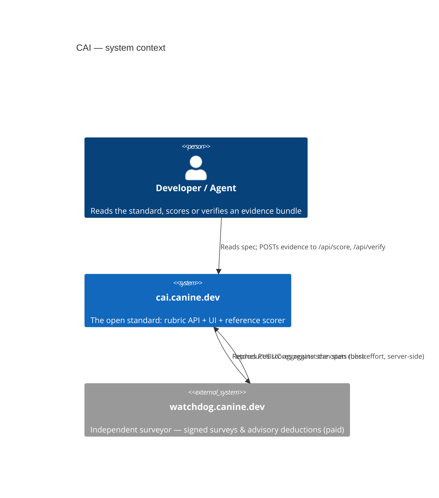
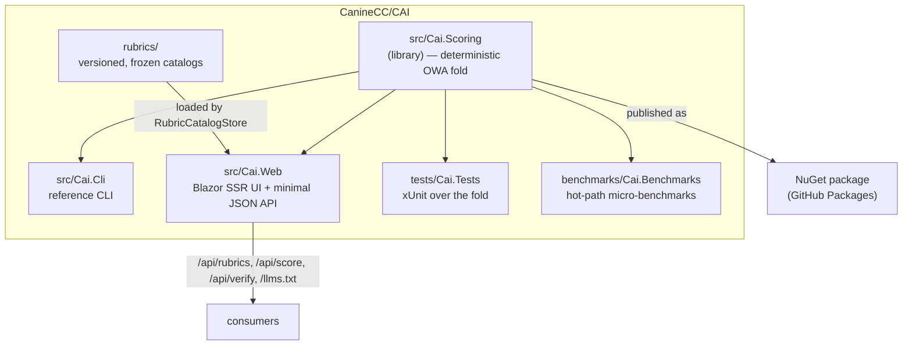

# CAI — Architecture

CAI (the Codebase Assurance Index) is an open, reproducible 0–100 standard for the health of a
.NET codebase: **same evidence in, same score out**. This document sketches the high-level shape;
the decisions behind it are recorded as [ADRs](adr/README.md).

## Context



The free/paid firewall (the deterministic measurement is open; the advisory survey is the
surveyor's product) is the defining boundary — see [ADR-0003](adr/0003-free-paid-firewall.md).

## Components



- **`Cai.Scoring`** — the heart: a pure, side-effect-free fold from an *evidence bundle* to a CAI
  headline and per-lens contributions. Deterministic by construction
  ([ADR-0002](adr/0002-deterministic-reproducible-scoring.md)). Published as a NuGet package.
- **`Cai.Cli`** — the reference command-line scorer; proves the fold runs anywhere.
- **`Cai.Web`** — a Blazor static-SSR site that documents the standard and a minimal HTTP API
  (`/api/rubrics`, `/api/score`, `/api/verify`) plus `/llms.txt` and a JSON-LD glossary. The public
  API is rate-limited; `/score` and `/verify` validate inbound evidence before folding.
- **`rubrics/`** — the versioned, frozen rubric catalogs cai.canine.dev owns
  ([ADR-0004](adr/0004-versioned-frozen-rubrics.md)).

## Repository layout

Production code lives under `src/`, tests under `tests/`, and performance benchmarks under
`benchmarks/` — a conventional separation by role rather than by deployment artifact
([ADR-0009](adr/0009-conventional-src-tests-layout.md)):

```
src/Cai.Scoring   src/Cai.Cli   src/Cai.Web      production code
tests/Cai.Tests                                  xUnit suite over the fold
benchmarks/Cai.Benchmarks                        BenchmarkDotNet hot-path benchmarks
rubrics/   examples/   docs/   deploy/           data, samples, docs, ops
```

All projects are referenced by one solution file, `Cai.slnx`, so Roslyn-based tooling loads the whole
graph ([ADR-0007](adr/0007-repository-solution-file.md)).

## Runtime & deployment

`Cai.Web` runs as a single systemd service (`cai-web.service`) on a self-hosted host, behind nginx
that terminates TLS. Deploys are verify-before-swap with health-check rollback
([ADR-0005](adr/0005-verify-before-swap-deploy.md)); build artifacts carry an SBOM, a keyless
signature and SLSA provenance ([ADR-0006](adr/0006-supply-chain-attestation.md)).

Observability: structured logging (`ILogger`), OpenTelemetry tracing + metrics (OTLP exporter active
only when an endpoint is configured), and a `/health` readiness check the deploy probes.

## Key cross-cutting constraints

- **Determinism** — no wall-clock, randomness or ambient I/O in the scoring fold.
- **Reproducibility** — every evidence bundle names its rubric version; old versions are retained.
- **Graceful degradation** — the standard pages render even when the surveyor is unreachable; the one
  outbound call is wrapped in a resilience pipeline (timeout + retry + circuit breaker).
