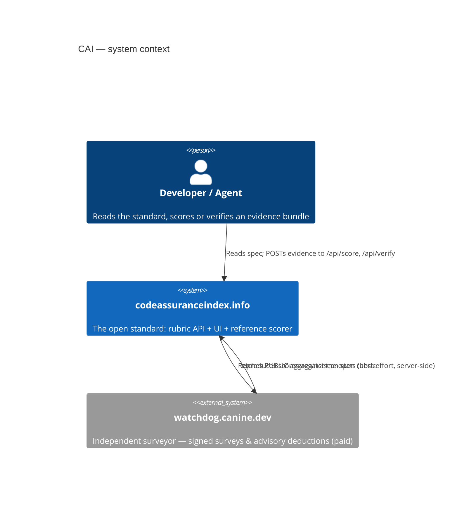
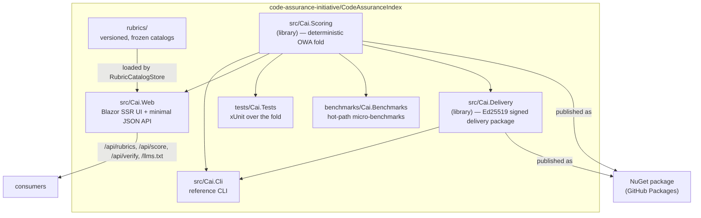

# CAI — Architecture

CAI (the Code Assurance Index) is an open, reproducible 0–100 standard for the health of a
.NET codebase: **same evidence in, same score out**. This document sketches the high-level shape;
the decisions behind it are recorded as [ADRs](adr/README.md).

## Context


```mermaid
C4Context
    title CAI — system context
    Person(consumer, "Developer / Agent", "Reads the standard, scores or verifies an evidence bundle")
    System(cai, "codeassuranceindex.info", "The open standard: rubric API + UI + reference scorer")
    System_Ext(surveyor, "watchdog.canine.dev", "Independent surveyor — signed surveys & advisory deductions (paid)")
    Rel(consumer, cai, "Reads spec; POSTs evidence to /api/score, /api/verify")
    Rel(cai, surveyor, "Fetches PUBLIC aggregate scan stats (best-effort, server-side)")
    Rel(surveyor, cai, "Reproduces scores against the open rubric")
```

The free/paid firewall (the deterministic measurement is open; the advisory survey is the
surveyor's product) is the defining boundary — see [ADR-0003](adr/0003-free-paid-firewall.md).

## Components


```mermaid
flowchart TD
    subgraph repo["code-assurance-initiative/CodeAssuranceIndex"]
        rubrics["rubrics/<br/>versioned, frozen catalogs"]
        scoring["src/Cai.Scoring<br/>(library) — deterministic OWA fold"]
        delivery["src/Cai.Delivery<br/>(library) — Ed25519 signed delivery package"]
        cli["src/Cai.Cli<br/>reference CLI"]
        web["src/Cai.Web<br/>Blazor SSR UI + minimal JSON API"]
        tests["tests/Cai.Tests<br/>xUnit over the fold"]
        bench["benchmarks/Cai.Benchmarks<br/>hot-path micro-benchmarks"]
    end
    nuget["NuGet package<br/>(GitHub Packages)"]
    rubrics -->|loaded by RubricCatalogStore| web
    scoring --> cli
    scoring --> web
    scoring --> tests
    scoring --> bench
    scoring --> delivery
    delivery --> cli
    scoring -->|published as| nuget
    delivery -->|published as| nuget
    web -->|/api/rubrics, /api/score, /api/verify, /llms.txt| consumer["consumers"]
```

- **`Cai.Scoring`** — the heart: a pure, side-effect-free fold from an *evidence bundle* to a CAI
  headline and per-lens contributions. Deterministic by construction
  ([ADR-0002](adr/0002-deterministic-reproducible-scoring.md)). Published as a NuGet package.
- **`Cai.Delivery`** — the reference signer/verifier for the **signed CAI-delivery package** (the shareable evidence
  artifact) and the registry contract behind it (producer push / consumer pull / seller→buyer access grants). Ed25519,
  signed by cai and reproducible offline; sits on top of `Cai.Scoring`
  ([ADR-0010](adr/0010-signed-cai-delivery-package-and-registry.md), [spec](spec/cai-delivery-package.md)).
- **`Cai.Cli`** — the reference command-line scorer (`score`/`verify`) and delivery tool
  (`keygen`/`sign`/`verify-delivery`); proves both folds run anywhere.
- **`Cai.Web`** — a Blazor static-SSR site that documents the standard and a minimal HTTP API
  (`/api/rubrics`, `/api/score`, `/api/verify`) plus `/llms.txt` and a JSON-LD glossary. The public
  API is rate-limited; `/score` and `/verify` validate inbound evidence before folding.
- **`Cai.Web.Registry`** — the signed-delivery registry: its endpoints, store, access rules and the
  embedded package schema. A library the host maps in, so it does not grow into the site by proximity
  ([ADR-0010](adr/0010-signed-cai-delivery-package-and-registry.md)).
- **`Cai.Web.Noise`** — the Noise Standard: its endpoints, store, signed corpus, judging pipeline and
  the three Blazor pages that read that store (`/noise/mark`, `/noise/rate`, `/noise/record`). Likewise
  a library, mapped into the same host; it reads the registry, never the other way round.
- **`rubrics/`** — the versioned, frozen rubric catalogs codeassuranceindex.info owns
  ([ADR-0004](adr/0004-versioned-frozen-rubrics.md)).

## Repository layout

Production code lives under `src/`, tests under `tests/`, and performance benchmarks under
`benchmarks/` — a conventional separation by role rather than by deployment artifact
([ADR-0009](adr/0009-conventional-src-tests-layout.md)):

```
src/Cai.Scoring  src/Cai.Delivery  src/Cai.Cli     production code: the folds and the tool
src/Cai.Web  src/Cai.Web.Registry  src/Cai.Web.Noise   the host and the two standards it serves
tests/Cai.Tests                                  xUnit suite over the fold
benchmarks/Cai.Benchmarks                        BenchmarkDotNet hot-path benchmarks
rubrics/  examples/  schemas/  docs/  deploy/    data, samples, schema, docs, ops
```

All projects are referenced by one solution file, `Cai.slnx`, so Roslyn-based tooling loads the whole
graph ([ADR-0007](adr/0007-repository-solution-file.md)).

### Layers inside a project

Each production project groups its files by **role**, in folders that say which layer a file belongs to.
Namespaces are declared explicitly and do not follow the folders, so these are labels for readers and
tools, not part of the API:

| Folder | What lives there |
|--------|------------------|
| `Domain/` | The rules and the model. Pure: no I/O, no clock, no ambient state. |
| `Infrastructure/` | The edges that touch something outside the process — SQLite, the file system, embedded resources, configuration binding, authentication handlers. |
| `Endpoints/` | The HTTP surface a host maps in, and the health checks it exposes. |
| `Pages/` | Blazor static-SSR components. |

The shape of a project is therefore readable from its folders. `Cai.Delivery` has only `Domain/`, which
is a claim, not an accident: signing and verifying a delivery touch nothing outside themselves, which is
what lets a consumer verify one offline. `Cai.Scoring` has a `Domain/` of eleven files and an
`Infrastructure/` of one — `RubricCatalogStore`, the only thing in the fold's project that reads a disk —
which is [ADR-0002](adr/0002-deterministic-reproducible-scoring.md)'s determinism claim, visible in the
tree. `Cai.Web.Noise` is mostly `Domain/`: the Noise Standard is a set of rules, and its store and its
endpoints are how those rules are reached, not what they are.

## Runtime & deployment

`Cai.Web` runs as a single systemd service (`cai-web.service`) on a self-hosted host, behind nginx
that terminates TLS. Deploys are verify-before-swap with health-check rollback
([ADR-0005](adr/0005-verify-before-swap-deploy.md)); build artifacts carry an SBOM, a keyless
signature and SLSA provenance ([ADR-0006](adr/0006-supply-chain-attestation.md)).

Observability: structured logging (`ILogger`), OpenTelemetry tracing + metrics (OTLP exporter active
only when an endpoint is configured), and a `/health` readiness check the deploy probes.

## Key cross-cutting constraints

- **Determinism** — no wall-clock, randomness or ambient I/O in the scoring fold.
- **Reproducibility** — every evidence bundle names its rubric version; old versions are retained.
- **Graceful degradation** — the standard pages render even when the surveyor is unreachable; the one
  outbound call is wrapped in a resilience pipeline (timeout + retry + circuit breaker).
